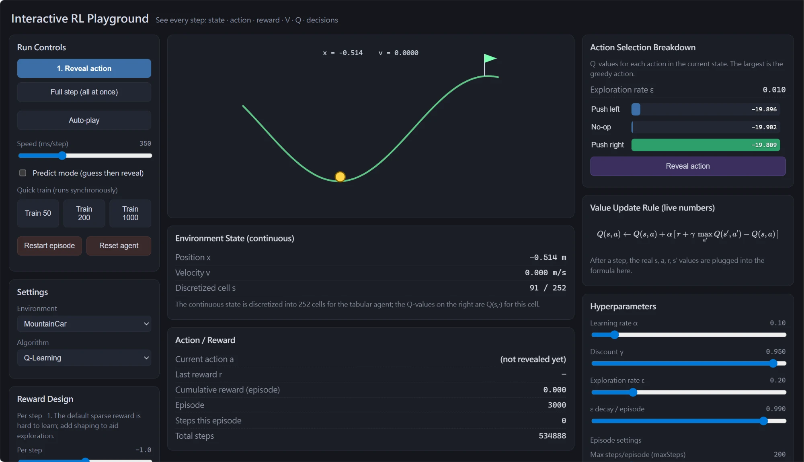
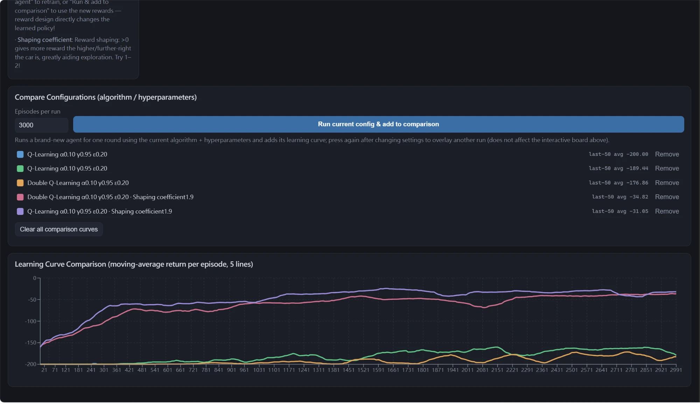

# Interactive RL Playground

An interactive reinforcement-learning teaching app that lets you **see every decision an algorithm makes, step by step**. Instead of just watching an agent run, it lays bare exactly *how each action is chosen* and *how each value is updated* — so you can work out the next action yourself from what is on screen.

It runs **entirely in the browser** — no backend, no API keys, no data setup. Even the deep-RL agents (DQN, PPO) train locally in a Web Worker. Clone, install, and start.



## Getting Started

Prerequisites: [Node.js](https://nodejs.org/) 18+ (which includes npm).

```bash
git clone https://github.com/twkuo/RL-interactive-learning.git
cd RL-interactive-learning
npm install
npm run dev
```

Then open the URL it prints (default <http://localhost:5173>). That's the whole setup — everything runs client-side.

Other scripts:

```bash
npm run build     # type-check + production build (output in dist/)
npm run preview   # serve the production build locally
npm run test      # unit tests (Vitest)
```

## What you can do

- **Pick an environment and an algorithm**, then step through learning one decision at a time.
- **See the full decision breakdown** for the current state: each action's Q-value (or policy probability π), which action is greedy, ε, the random draw, the explore/exploit verdict, and the chosen action with a plain-language rationale.
- **Prediction mode**: guess the next action before it is revealed, then check yourself.
- **Watch the value update**: the update rule is rendered with the live numbers plugged in (KaTeX), with the TD error highlighted. (Monte Carlo / REINFORCE update at the end of an episode and show a summary instead.)
- **Train quickly** for N episodes, then inspect the learned policy.
- **Compare configurations**: overlay learning curves for different algorithms / hyperparameters / rewards on a single chart.
- **Design the reward**: edit each environment's reward parameters live and watch how it changes what the agent learns (for example, add position shaping to make MountainCar learnable).
- **Train deep RL in the browser**: DQN and PPO learn from the raw continuous state with a small neural network (TensorFlow.js), trained in a **Web Worker** so the UI stays responsive — with live dashboards (loss, replay-buffer fill / rollout stats, ε, TD-error, entropy, KL). Then step through the trained policy exactly like the tabular methods.



*Overlaying learning curves to compare configurations. Here the two top curves use reward shaping, which lets MountainCar actually reach the goal (last-50 average around −30), while the default sparse reward stalls near −200 (bottom curves).*

## Environments

| Environment | State | Actions | Notes |
|---|---|---|---|
| GridWorld 5x5 | discrete | 4 | walls, traps, goal; editable rewards |
| FrozenLake 4x4 | discrete | 4 | deterministic or slippery (stochastic) |
| CartPole | continuous (x, ẋ, θ, θ̇) | 2 | balance the pole; physics from Gymnasium |
| MountainCar | continuous (x, v) | 3 | drive up the hill; optional reward shaping |
| Acrobot | continuous (6D) | 3 (torque) | swing the two-link arm above the bar; deep-RL |
| LunarLander | continuous (8D) | 4 (engines) | land gently on the pad between the flags; deep-RL |
| Pendulum | continuous (3D) | **continuous** torque | swing up and balance; PPO Gaussian policy |

Continuous environments run real physics internally. For the **tabular** algorithms they are **discretized** (state aggregation) into a finite index, so the same agents work on them unchanged. The **deep-RL** algorithms (DQN, PPO) instead read the **raw continuous vector** directly — no discretization.

## Algorithms

**Tabular** (an exact table of Q / π over discrete states):

- **Q-Learning** — off-policy TD control
- **SARSA** — on-policy TD control
- **Expected SARSA** — bootstraps with the ε-greedy expected value
- **Double Q-Learning** — reduces maximization bias with two Q-tables
- **Monte Carlo Control** — first-visit; uses full-episode returns (bootstraps the tail on truncation)
- **REINFORCE** — softmax policy gradient (learns a policy π, not Q)

**Deep RL** (neural-network function approximation, trained in a Web Worker with TensorFlow.js):

- **DQN** — Double DQN with experience replay, a target network, and Huber loss
- **PPO** — actor-critic with GAE(λ), a clipped surrogate objective, and an entropy bonus

The deep agents read the raw continuous observation (with input normalization) and keep the **best policy found** during training for inference. Both stabilizers — input normalization and keep-best — are toggles, so you can switch them off and watch training degrade (a built-in lesson in why they matter).

## Architecture

Algorithms are environment-agnostic and depend only on the `Environment` interface, so any environment works with any algorithm. Everything runs on the front end (React + TypeScript + Vite + Zustand).

```
src/
├─ core/     types, rng, utils, spaces, discretize · nn/{mlp,replayBuffer,weights}
├─ envs/     registry · discrete/{GridWorld,FrozenLake} · continuous/{CartPole,CartPoleVec,MountainCar,Acrobot,Pendulum,LunarLander} · physics/
├─ algos/    TabularQ · tabular/{QLearning,Sarsa,ExpectedSarsa,DoubleQLearning,MonteCarlo,Reinforce} · deep/{DQN,PPO} · registry
├─ training/ trainer.worker (TensorFlow.js) · protocol
├─ state/    store (Zustand + step-by-step reveal state machine)
├─ canvas/   draw · colormap
└─ viz/      renderers · panels · charts · controls
```

A few design choices worth noting:

- `terminated` and `truncated` are kept separate — bootstrapping zeroes the successor value only on `terminated`, never on a time-limit truncation.
- Tabular agents use state discretization; the deep agents use neural-network function approximation on the raw continuous state.
- Deep-RL training runs in a **Web Worker** (TensorFlow.js, wasm backend) and streams progress to the UI; the trained weights load into a main-thread model so the synchronous step-by-step view still works. TensorFlow.js is **dynamically imported**, so the tabular experience stays lightweight.

## Tech stack

React 19, TypeScript, Vite, Zustand, Recharts, KaTeX, d3-scale-chromatic, Vitest, and TensorFlow.js (Web Worker training, lazily loaded).

## License

This project is dual-licensed:

* **Source Code:** The underlying source code for the interactive components and website structure is licensed under the [MIT License](LICENSE).
* **Educational Content:** All text, explanations, and diagrams are licensed under a [Creative Commons Attribution 4.0 International License (CC BY 4.0)](https://creativecommons.org/licenses/by/4.0/). You are free to share and adapt the content, even for commercial purposes, as long as you provide appropriate credit to this repository.
